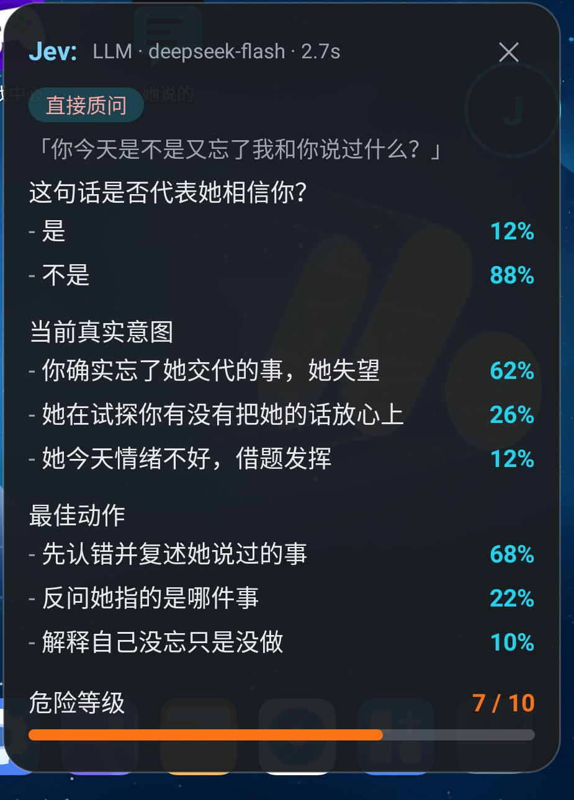

# SayWhat · 她说的

> 挂在聊天软件上的 AI 语境分析悬浮窗：对方发来一句话，卡片立刻给出 **真实意图概率 / 危险等级 / 最佳动作**。

安卓原生 App（Kotlin），核心链路是「**读屏 → LLM 判断 → 悬浮卡片**」。
分析引擎**可替换**：默认走任意 OpenAI 兼容接口，并预留了 Jev（TypeSafe System One）适配位。



> 上图：点悬浮球后弹出的分析卡片（演示数据）——「是否相信你」概率、「当前真实意图」多项概率、「最佳动作」建议、危险等级条。

---

## ✨ 功能特性

- 🪟 **系统级悬浮窗** —— 常驻微信之上、可拖拽，不打断聊天
- 👀 **两条读消息通道**
  - 无障碍服务（`AccessibilityService`）优先
  - **截屏 OCR 兜底**（微信对无障碍不友好时使用）
- 🧠 **LLM 语境分析** —— 输出结构化卡片：是/否概率、多选意图（含每项概率）、危险等级 1–10、建议动作
- 🔀 **两段式分析** —— 先判断「这是哪种情境」，再按情境问对应问题；**日常闲聊直接跳过**，不浪费调用
- 🔌 **引擎可替换** —— `SubtextEngine` 接口 + `LlmEngine`（主线）/ `JevEngine`（预留插槽）
- 🛡️ **解析兜底** —— 模型输出跑偏时自动降级，不会白卡片
- 🔋 **保活引导** —— 一键跳转「忽略电池优化」，避免服务被系统冻结
- 📋 **运行日志** —— 出问题可导出日志定位

---

## 🚀 快速开始（三步）

### 1️⃣ 授权

打开 App，按引导依次授权：

| 权限 | 用途 |
| --- | --- |
| **悬浮窗**（显示在其他应用上层） | 显示分析卡片 |
| **无障碍服务** | 读取聊天文本 |
| **通知** | 前台服务常驻 |

> 若微信对无障碍不友好，改用**截屏通道**：授权录屏后由截屏读取消息。

### 2️⃣ 填 API

「设置」→ 填 **API Base / API Key / 模型名**（默认适配 DeepSeek 等 OpenAI 兼容接口）。

### 3️⃣ 开始用

打开微信聊天 → 悬浮球常驻 → 收到对方消息时点击悬浮球，卡片弹出分析结果。

---

## 🔐 隐私说明

- **消息只在本机提取**，仅**单条**发往**你自己配置的** LLM 接口；
- **不做聊天记录持久化**、不上传任何服务器、不做多人共享；
- `allowBackup="false"` —— 系统备份不含本应用数据；
- 只声明探测微信包名（`<queries>`），**不申请 `QUERY_ALL_PACKAGES`**；
- **API Key 仅存本机**。

---

## ⚠️ 免责声明

本项目是**娱乐向的个人工具**，用于自娱自乐地「解读」聊天语境。

- 它的判断**由大模型生成，不构成任何事实、建议或对他人的评判**；
- **不是监控、追踪或取证工具**，请勿用于监视他人；
- 使用者应自行遵守当地法律法规与平台服务条款；因使用产生的任何后果由使用者自负；
- 本项目与**腾讯 / 微信官方无任何关联**，未经其授权或认可。

---

## 🏗️ 技术栈

- **Kotlin** + Android SDK（JDK 17 / Gradle 8.9）
- **零第三方网络库** —— 用 `HttpURLConnection` 直连
- 前台服务 + 悬浮窗 + 无障碍服务 + MediaProjection（截屏）
- 包名 `com.saywhat.app`

---

## 🔨 构建

```bash
./gradlew assembleDebug
```

产物：`app/build/outputs/apk/debug/app-debug.apk`

> **国内网络提示**：`gradle/wrapper/gradle-wrapper.properties` 的 `distributionUrl` 默认指向官方源。
> 若下载失败，可临时改成腾讯镜像：
> `https://mirrors.cloud.tencent.com/gradle/gradle-8.9-bin.zip`

---

## 📄 License

[MIT](LICENSE)

---

## English Summary

**SayWhat** is a small Android overlay app that reads an incoming chat message and shows a probabilistic
"subtext card": *is she literally asking what she seems to ask?*, *what is the real intent (with
probabilities)?*, *how dangerous is this message (1–10)?*, and *what to do next*.

- Reads messages via an **Accessibility Service**, with a **screen-capture fallback**
- Analyses with **any OpenAI-compatible LLM** — the engine is pluggable (a Jev / TypeSafe adapter is stubbed)
- **Privacy-first**: extraction stays local, a single message goes to *your own* endpoint, no persistence, no server
- **For entertainment only** — not a surveillance tool.
